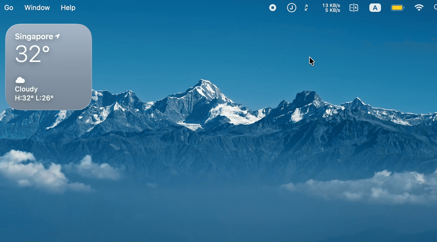

<div align="center">


# JBar

**即刻（okjike）关注流 macOS 菜单栏通知应用**

</div>

## 演示



> 高清带交互版（完整画质）👉 [demo.mp4](https://github.com/joway/jbar/raw/main/demo.mp4)

## 功能

- 🔑 **扫码登录**：首次启动用即刻 App 扫码授权，token 安全存于本地。
- 🔔 **新动态提醒**：定时（默认 60s）拉取关注流，发现新动态即弹通知。
- 📺 **刘海风格通知**：通知从屏幕顶部中央"生长"展开，贴合刘海；多条新动态逐条排队弹出。
- 🔗 **一键直达**：点击通知在默认浏览器打开该动态网页版（`m.okjike.com`）。
- 🧭 **纯菜单栏**：无 Dock 图标，安静驻留菜单栏。

## 安装

1. 到 [Releases](https://github.com/joway/jbar/releases/latest) 下载 `JBar-x.y.z.zip`。
2. 解压后把 **JBar.app** 拖进「应用程序」。
3. 双击打开 —— 应用已用 Apple Developer ID 签名并经 Apple 公证，可直接运行，无需取消 Gatekeeper。
4. 首次启动会弹出二维码，用即刻 App 扫码登录即可。

之后它会驻留菜单栏（黄色圆圈 **J** 图标），定时检查关注流。

## 从源码构建

需要 macOS 13+ 与 Xcode 命令行工具（Swift 5.9+）。

```bash
git clone https://github.com/joway/jbar.git
cd jbar

# 本地构建（ad-hoc 签名，自用）
./build_app.sh
open build/JBar.app
```

> Firebase Analytics 需要 `GoogleService-Info.plist`（已被 `.gitignore` 忽略）。
> 没有该文件也能编译运行，只是不上报分析事件。

### 发布（Developer ID 签名 + 公证）

```bash
# 一次性存储公证凭据
xcrun notarytool store-credentials "notarytool" \
  --apple-id "<Apple ID>" --team-id "<Team ID>" --password "<App 专用密码>"

# 构建 → 签名 → 公证 → staple → 打包 → 发 GitHub Release
./release.sh 1.0.0
```

## 技术栈

- **Swift + AppKit**，菜单栏 `NSStatusItem` + 自绘刘海通知 `NSPanel`（SwiftUI 卡片）。
- **URLSession** 封装即刻接口（登录 / 关注流 / token 刷新）。
- **Firebase Analytics**（macOS）做使用分析。
- 纯 SwiftPM 可执行 target，经 `build_app.sh` 打包为 `.app`。

## 隐私

- 即刻 token 仅保存在本机 `~/Library/Application Support/JBar/`，不上传任何第三方。
- 仅访问即刻官方接口与（可选的）Firebase 分析。

---

<div align="center">
即刻接口参考：<a href="https://github.com/joway/jike-skill/blob/main/SKILL.md">jike-skill</a>
</div>
